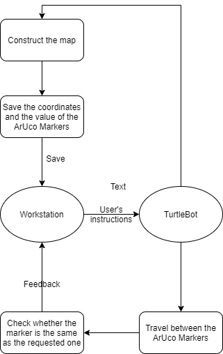

# **Landmark Detection Based on TurtleBot**


## Abstract
In this project, a **kinect turtlebot** is used to map the environment, as well as detect **ArUco markers** and save their coordinates in a 3-dimensional array. Then, on user's request, the turtlebot will go to one of the markers and able to travel between them in the requested order.

## Requirements
### Software packages
* **OS:** ROS Kinetic
* **Language:** C++
* **Dependancies:** ArUco, Amcl, Rviz, move_base, ...

### Hardware
* **Components:** LiDAR Hokuyo, Kinect
* **Other evalution and development systems:** TurtleBot Kobuki base

## Installation and setup
Open Source related to TurtleBot 2  
* [TurtleBot_bringup](http://wiki.ros.org/turtlebot_bringup)
* [TurtleBot_navigation](http://wiki.ros.org/turtlebot_navigation)
* [Rviz](http://wiki.ros.org/rviz)
* [LiDAR Hokuyo](https://blog.csdn.net/Buer_zhu/article/details/80945830)
* [Aruco](http://wiki.ros.org/aruco)
* [usb_cam](http://wiki.ros.org/usb_cam)
* [A small tool for generating ArUco markers](https://tn1ck.github.io/aruco-print/)   
...

## Architecture



## Examples
currently working on this, and we will fix this later:)
```c++
#include <ros/ros.h>
#include <move_base_msgs/MoveBaseAction.h>
#include <actionlib/client/simple_action_client.h>

typedef actionlib::SimpleActionClient<move_base_msgs::MoveBaseAction> MoveBaseClient;

int main(int argc, char** argv){
  ros::init(argc, argv, "simple_navigation_goals");

  //tell the action client that we want to spin a thread by default
  MoveBaseClient ac("move_base", true);

  //wait for the action server to come up
  while(!ac.waitForServer(ros::Duration(5.0))){
    ROS_INFO("Waiting for the move_base action server to come up");
  }

  move_base_msgs::MoveBaseGoal goal;

  //we'll send a goal to the robot to move 1 meter forward
  goal.target_pose.header.frame_id = "base_link";
  goal.target_pose.header.stamp = ros::Time::now();

  goal.target_pose.pose.position.x = 1.0;
  goal.target_pose.pose.orientation.w = 1.0;

  ROS_INFO("Sending goal");
  ac.sendGoal(goal);

  ac.waitForResult();

  if(ac.getState() == actionlib::SimpleClientGoalState::SUCCEEDED)
    ROS_INFO("Hooray, the base moved 1 meter forward");
  else
    ROS_INFO("The base failed to move forward 1 meter for some reason");

  return 0;
}
```
